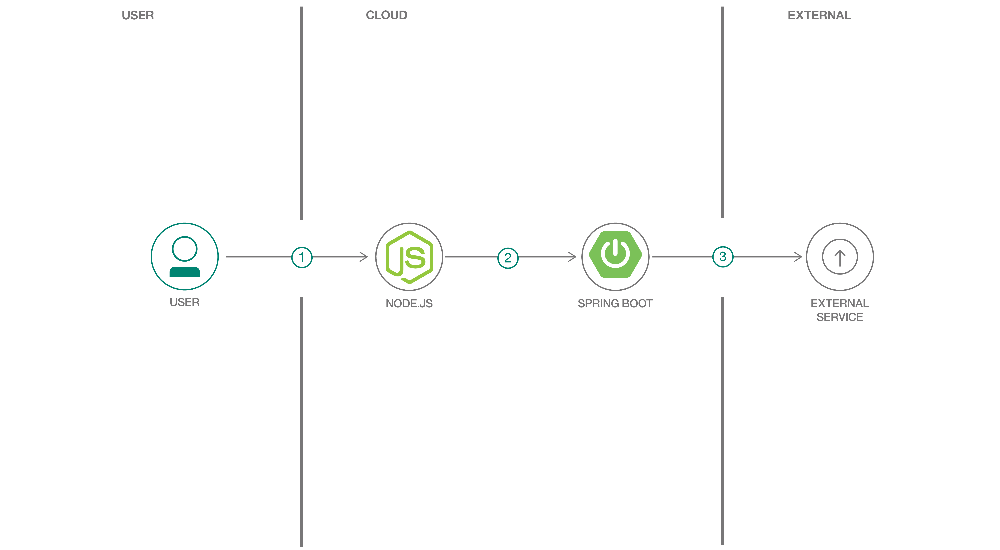
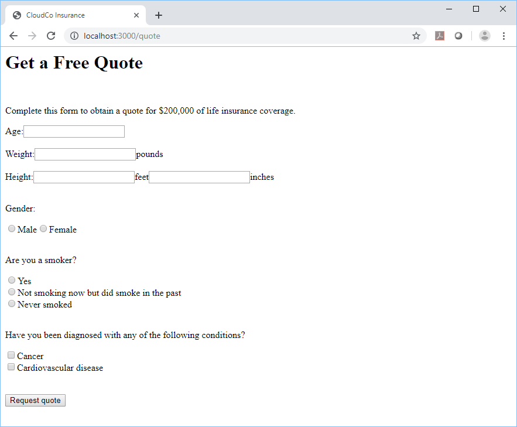
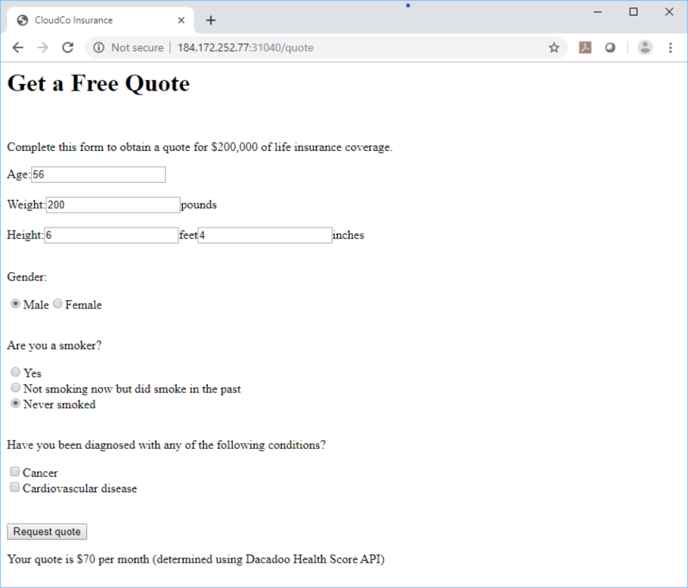

[](https://travis-ci.org/IBM/appsody-sample-quote-app)

# Creating an insurance quote application using Appsody

In this code pattern, we will show how to create a sample insurance quote application using Appsody.
Appsody is an open source project that provides the following tools you can use to build cloud-native applications:

* a command-line interface to develop containerized applications, test them locally, and then build and deploy them to Kubernetes

* a set of pre-configured "stacks" and templates for popular open source runtimes (such as Node.js and Spring Boot) on which to build applications

When you have completed this code pattern, you will understand how to

* create a frontend web application and a backend REST application using the Appsody Node.js Express and Spring Boot stacks
* test the applications locally in a containerized environment
* deploy the applications to the IBM Cloud Kubernetes Service

<!--add an image in this path-->


## Flow

1. The user enters the URL of the frontend application into a browser.  The frontend application displays an insurance quote form in response.
2. The user fills in the form and clicks a button to submit it.  The frontend application validates the form data and sends a REST request to the backend application.
3. The backend application uses the [Dacadoo Health Score API](https://info.dacadoo.com/) to compute a health score from the form data and then computes a quote from that.

## Prerequisites

In order to build and test applications on your local workstation, complete the following steps.

* [Install the Appsody CLI](https://appsody.dev/docs/getting-started/installation)

* [Install Docker](https://docs.docker.com/get-started/)

In order to deploy the applications to the IBM Cloud Kubernetes Service, complete the following steps.

* [Install the CLIs to manage a cluster](https://cloud.ibm.com/docs/containers?topic=containers-cs_cli_install#cs_cli_install_steps)

* [Create a free Kubernetes cluster in IBM Kubernetes Service](https://cloud.ibm.com/docs/containers?topic=containers-getting-started#classic-cluster-create)

* [Create a private container registry in IBM Cloud Container Registry](https://cloud.ibm.com/docs/services/Registry?topic=registry-registry_setup_cli_namespace#registry_setup_cli_namespace)

In order to use the Dacadoo Health Score API, visit https://models.dacadoo.com/doc/ to request an API key for evaluation purposes.

# Steps

1. [Clone the repo](#1-clone-the-repo).
2. [Create the frontend application and run it locally](#2-create-the-frontend-application-and-run-it-locally)
3. [Create the backend application and run it locally](#3-create-the-backend-application-and-run-it-locally)
4. [Deploy the backend application to the IBM Cloud](#4-deploy-the-backend-application-to-the-IBM-Cloud)
5. [Deploy the frontend application to the IBM Cloud](#5-deploy-the-frontend-application-to-the-IBM-Cloud)

### 1. Clone the repo

Clone the `appsody-sample-quote-app` repo locally. In a terminal, run:

```bash
git clone https://github.com/IBM/appsody-sample-quote-app
```

### 2. Create the frontend application and run it locally

The frontend application is written in Node.js Express.  First let's initialize an Appsody project that uses the Node.js Express stack.

```bash
$ mkdir quote-frontend
$ cd quote-frontend
$ appsody init nodejs-express
```

After `appsody init` completes, list the content of the directory.  You'll see that Appsody has created a starter application for you.

```bash
$ ls -l
-rwxrwxrwx 1 gregd gregd   130 Sep 10 13:48 app.js
-rwxrwxrwx 1 gregd gregd 51421 Sep 10 13:48 package-lock.json
-rwxrwxrwx 1 gregd gregd   455 Sep 10 13:48 package.json
drwxrwxrwx 1 gregd gregd  4096 Sep 10 13:48 test
```

It's possible to run this application on your workstation immediately.

```bash
$ appsody run
```

Appsody builds a containerized version of the application for you and runs it in Docker.
You can enter http://localhost:3000 in a browser to see the default endpoint served by the application.

The Node.js Express stack also provides out-of-the-box health checking and application metrics endpoints
and a performance monitoring and analysis dashboard (which is only present in this development container and not the production container which we'll build later).

- Health endpoint: http://localhost:3000/health
- Liveness endpoint: http://localhost:3000/live
- Readiness endpoint: http://localhost:3000/ready
- Metrics endpoint: http://localhost:3000/metrics
- Dashboard endpoint: http://localhost:3000/appmetrics-dash (development only)

While the containerized application is running you can edit the application and your changes will be reflected in the running container.
You can test this by editing the app.js module and changing the message returned by the default endpoint.
Watch the `appsody run` console session for the application to restart.
Then refresh your browser window and you will see the new message.

We're going to replace the starter code with the insurance quote frontend application.
First you must edit the package.json file and add the following dependencies:

```
  .
  .
  .
  "dependencies": {
    "body-parser": "^1.19.0",
    "config": "^3.2.0",
    "express-validator": "^6.2.0",
    "pug": "^2.0.0",
    "request": "^2.88.0"
  },
  "devDependencies": {
  .
  .
  .
```

The Node.js Express stack installs the package dependencies into the containerized application.
However it won't do this when the containerized application is already running.
You must stop the current application by pressing `Ctrl-C` and then re-run `appsody run` to start it back up.

Now copy the files from the `quote-frontend` directory in this git repo to your Appsody project.
Watch for the container to restart and then refresh your browser again.
You will see a form appear.



You can fill in the form and hit the button to submit it and a response will appear.
In this case the frontend application is not sending a request to the backend application.
Instead it is configured to use a mock endpoint for testing purposes in development mode.
This works as follows.

* `quote.js` uses the [config](https://www.npmjs.com/package/config) module to get the value for the backend URL.
* When the application runs in development mode, the config module uses `config/development.json` to find the value for the backend URL.
This file sets the URL to the mock endpoint.
    ```
    {
      "backendUrl": "http://localhost:3000/quote/test"
    }
    ```
* When the application runs in production mode (which we'll see later), the config module uses `config/custom-environment-variables.json` to find the value for the backend URL.
This file sets the URL from the `BACKEND_URL` environment variable.
    ```
    {
      "backendUrl": "BACKEND_URL"
    }
    ```

Appsody provides a way to run automated tests against the containerized application.

```
$ appsody test
```

This runs tests that come packaged with the stack (such as tests of the health and metrics endpoints),
and of course you can add your own tests of your application as well.
Look at `test/test.js` to see the tests for the frontend application.

### 3. Create the backend application and run it locally

The backend application is written in Spring Boot.  Let's initialize an Appsody project that uses the Spring Boot 2 stack.

```bash
$ mkdir quote-backend
$ cd quote-backend
$ appsody init java-spring-boot2
```

Again you'll see that Appsody has created a starter application for you.
It's possible to run this application on your workstation immediately.

```bash
$ appsody run
```

Appsody builds a containerized version of the application for you and runs it in Docker.
You can enter http://localhost:8080 in a browser to see the default endpoint served by the application.

The Spring Boot 2 stack also provides out-of-the-box health checking and application metrics endpoints.

- Health endpoint: http://localhost:8080/actuator/health
- Liveness endpoint: http://localhost:8080/actuator/liveness
- Metrics endpoint: http://localhost:8080/actuator/metrics
- Prometheus endpoint: http://localhost:8080/actuator/prometheus

We're going to replace the starter code with the insurance quote backend application.
Edit the pom.xml file and add the following dependency to the dependencies section.

```
  <dependencies>
    .
    .
    .
    <dependency>
        <groupId>org.projectlombok</groupId>
        <artifactId>lombok</artifactId>
        <version>1.18.8</version>
    </dependency>
  </dependencies>
```

Now copy the files from the `quote-backend` directory in this git repo to your Appsody project.
Watch for the container to restart.

You can test the backend API using [curl](https://curl.haxx.se/download.html).

```
curl -X POST  -d @backend-input.json  -H "Content-Type: application/json"  http://localhost:8080/quote
```

In this case the backend application is not sending a request to the Dacadoo health score API.
Instead it is configured to use a mock endpoint for testing purposes in development mode.
This works as follows:

* `src/main/java/application/Quote.java` uses `@Value("${DACADOO_URL}")` and `@Value("${DACADOO_APIKEY}")` to get the values of the Dacadoo Health Score API endpoint URL and the API key.
* `src/main/resources/application.yaml` defines mock values for the URL and API key.
    ```
    DACADOO_URL: http://localhost:8080/mockscore
    DACADOO_APIKEY: TEST
    ```
* When the application runs in production mode (which we'll see later), environment variables can be used to set the URL and API key.
Environment variables override the values in the `application.yaml` file.

You can use `appsody test` to run automated tests for this application.

```
$ appsody test
```

Look at `src/test/java/application/QuoteTest.java` to see the tests for the backend application.

### 4. Deploy the backend application to the IBM Cloud

We are now going to deploy both applications to the IBM Cloud Kubernetes Service starting with the backend application.

We will use the `appsody deploy` command for the deployments.  This command
* builds a deployment image for production usage (i.e. it does not include development-mode tools)
* pushes the image to your designated image registry
* builds a deployment yaml file
* applies the yaml file to your Kubernetes cluster

In order to have the backend application sends requests to the Dacadoo Health Score API,
we need to create a secret that contains the configuration for making requests to the Dacadoo server.
(Note: If you do not want to use the Dacadoo Health Score API, you can skip this setup and continue to use the mock endpoint.)

```
kubectl create secret generic dacadoo-secret --from-literal=url=<url> --from-literal=apikey=<apikey>
```

where
* `<url>` is the URL of the Dacadoo server (e.g. `https://models.dacadoo.com/score/2`)
* `<apikey>` is the API key that you obtained when you registered to use the API.

We need to modify the deployment yaml to pass the secret's values to the application.
The initial deployment yaml can be generated as follows.

```
appsody deploy --generate-only
```

This creates a file named `app-deploy.yaml` in your project.  Edit the file.
You will notice that this yaml file contains an `AppsodyApplication` custom resource.
This resource is handled by an Appsody operator that is installed into your cluster the first time you deploy an Appsody application.
The operator handles creating the standard Kubernetes resources (such as Deployment) from the `AppsodyApplication` resource.
It is beyond the scope of this code pattern to go into the details of this resource or the operator.
If you would like to know more about it, take a look at the [user guide](https://github.com/appsody/appsody-operator/blob/master/doc/user-guide.md).

Add the following bold lines to the yaml file.  These lines instruct Kubernetes how to set environment variables from the secret we just created.
Be careful to match the indentation (`env:` is indented the same number of spaces as `applicationImage:`).

<pre>
apiVersion: appsody.dev/v1beta1
kind: AppsodyApplication
metadata:
  name: quote-backend
spec:
  # Add fields here
  version: 1.0.0
  applicationImage: quote-backend
  <b>env:
    - name: dacadoo_url
      valueFrom:
        secretKeyRef:
          name: dacadoo-secret
          key: url
    - name: dacadoo_apikey
      valueFrom:
        secretKeyRef:
          name: dacadoo-secret 
          key: apikey</b>
  .
  .
  .
</pre>

You do not need to update `applicationImage` with your image registry because the `appsody deploy` command will take care of that.
However, because we're going to push the image to a private registry, we need to update the yaml with the pull secret which is needed to authenticate to the registry.
Your cluster is prepopulated with secrets to access each regional registry.

```
$ kubectl get secrets --field-selector type=kubernetes.io/dockerconfigjson
NAME                TYPE                             DATA   AGE
default-au-icr-io   kubernetes.io/dockerconfigjson   1      1d
default-de-icr-io   kubernetes.io/dockerconfigjson   1      1d
default-icr-io      kubernetes.io/dockerconfigjson   1      1d
default-jp-icr-io   kubernetes.io/dockerconfigjson   1      1d
default-uk-icr-io   kubernetes.io/dockerconfigjson   1      1d
default-us-icr-io   kubernetes.io/dockerconfigjson   1      1d
```

In order to determine which region you are using, you can use the `ibmcloud cr region` command.

```
$ ibmcloud cr region
You are targeting region 'us-south', the registry is 'us.icr.io'.
```

In this example the registry is `us.icr.io` so the corresponding secret to use is `default-us-icr-io`.
Add the following bold line to the yaml file (but use the correct secret for your region):

<pre>
apiVersion: appsody.dev/v1beta1
kind: AppsodyApplication
metadata:
  name: quote-backend
spec:
  # Add fields here
  version: 1.0.0
  applicationImage: quote-backend
  <b>pullSecret: default-us-icr-io</b>
  env:
    - name: dacadoo_url
      valueFrom:
        secretKeyRef:
          name: dacadoo-secret
          key: url
    - name: dacadoo_apikey
      valueFrom:
        secretKeyRef:
          name: dacadoo-secret 
          key: apikey
  .
  .
  .
</pre>

This completes the editing of the yaml file so save it.

At this point we're almost ready to push the image to the registry and deploy it to the cluster.
In order to push the image we need to login to the image registry first.

```
$ ibmcloud cr login
```

Now use `appsody deploy` to push the image and deploy it.

```
$ appsody deploy -t <your image registry>/<your namespace>/quote-backend:1 --push
```

where
* `<your image registry>` is the host name of your regional registry, for example `us.icr.io`
* `<your namespace>` is a namespace you created in your registry

After the deployment completes, you can test the service using curl.

```
curl -X POST  -d @backend-input.json  -H "Content-Type: application/json"  http://<node IP address>:<node port>/quote
```

where
* `<node IP address>` is the external IP address of your node which you can obtain using the command `kubectl get node -o wide`
* `<node port>` is the node port assigned to the service which you can obtain using the command `kubectl get svc quote-backend`

Note that because we are using a free Kubernetes cluster, the AppsodyApplication is limited to exposing the service via a node port.
If you use a standard cluster with Knative installed, or a Red Hat OpenShift on IBM Cloud cluster, you have the option to expose the service via
an ingress resource or a route resource.

### 5. Deploy the frontend application to the IBM Cloud

We are now going to deploy the frontend application to the IBM Cloud Kubernetes Service.
The steps are similar to what we did for the backend application.

First we need to generate the deployment yaml so that we can edit it.

```
appsody deploy --generate-only
```

Edit the file that was created, `app-deploy.yaml`, and add the following bold lines to the yaml file.
The `pullSecret` should be the same value you used in the backend application.
The `env` section defines an environment variable with the URL of the backend application within the cluster.
Be careful to match the indentation (`pullSecret:` and `env:` are indented the same number of spaces as `applicationImage:`).

<pre>
apiVersion: appsody.dev/v1beta1
kind: AppsodyApplication
metadata:
  name: quote-frontend
spec:
  # Add fields here
  version: 1.0.0
  applicationImage: quote-frontend
  <b>pullSecret: default-us-icr-io
  env:
  - name: BACKEND_URL
    value: http://quote-backend:8080/quote</b>
  .
  .
  .
</pre>

Save the yaml file and do the deployment.

```
$ appsody deploy -t <your image registry>/<your namespace>/quote-frontend:1 --push
```

where
* `<your image registry>` is the host name of your regional registry, for example `us.icr.io`
* `<your namespace>` is a namespace you created in your registry

After the deployment completes, use a browser to open the frontend application.
Use `http://<node IP address>:<nodeport>` where
* <node IP address> is the external IP address of your node which you can obtain using the command `kubectl get node -o wide`
* <node port> is the node port assigned to the service which you can obtain using the command `kubectl get svc quote-backend`

Fill in the form and click the button to submit it.
You should get a quote from the backend application.



## License

This code pattern is licensed under the Apache License, Version 2. Separate third-party code objects invoked within this code pattern are licensed by their respective providers pursuant to their own separate licenses. Contributions are subject to the [Developer Certificate of Origin, Version 1.1](https://developercertificate.org/) and the [Apache License, Version 2](https://www.apache.org/licenses/LICENSE-2.0.txt).

[Apache License FAQ](https://www.apache.org/foundation/license-faq.html#WhatDoesItMEAN)